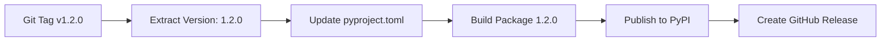
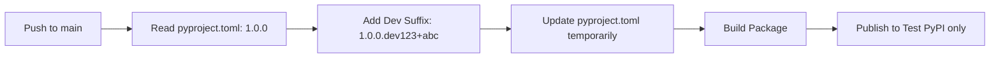

# Automated Version Management

The ITL ControlPlane SDK pipeline now automatically manages package versioning based on git tags, eliminating the need for manual `pyproject.toml` updates.

## 🚀 How It Works

### **Release Versions (Automatic)**
- **Trigger**: Create and push a version tag (e.g., `v1.2.0`)
- **Process**: Pipeline automatically updates `pyproject.toml` with tag version
- **Result**: Package published to PyPI with exact tag version

### **Development Versions (Automatic)**
- **Trigger**: Push to main/develop branches (no tag)
- **Process**: Pipeline appends `.devN+sha` to base version
- **Result**: Package published to Test PyPI only

## 📋 New Release Workflow

### **Simple Release Process**
```bash
# 1. No need to edit pyproject.toml manually!
# 2. Just create and push a version tag
git tag v1.2.0
git push origin v1.2.0

# Pipeline automatically:
# - Updates pyproject.toml: version = "1.2.0" 
# - Builds package with version 1.2.0
# - Publishes to PyPI as itl-controlplane-sdk==1.2.0
# - Creates GitHub release v1.2.0
```

### **Development Workflow**
```bash
# 1. Make changes and push
git push origin main

# Pipeline automatically:
# - Uses base version from pyproject.toml (e.g., "1.0.0")
# - Creates dev version: "1.0.0.dev123+abc1234"
# - Publishes to Test PyPI only
```

## 🔄 Version Flow Details

### **Tag-Based Releases**


### **Development Builds**


## 📝 Version Examples

### **Release Versions**
| Git Tag | pyproject.toml (auto-updated) | Published Version |
|---------|-------------------------------|-------------------|
| `v1.0.0` | `version = "1.0.0"` | `itl-controlplane-sdk==1.0.0` |
| `v1.2.0` | `version = "1.2.0"` | `itl-controlplane-sdk==1.2.0` |
| `v2.0.0-beta1` | `version = "2.0.0-beta1"` | `itl-controlplane-sdk==2.0.0b1` |

### **Development Versions**
| Base Version | Build Number | Commit SHA | Published Version |
|-------------|--------------|------------|-------------------|
| `1.0.0` | `123` | `abc1234` | `itl-controlplane-sdk==1.0.0.dev123+abc1234` |
| `1.5.0` | `456` | `def5678` | `itl-controlplane-sdk==1.5.0.dev456+def5678` |

## 🎯 Best Practices

### **Version Naming**
```bash
# Semantic versioning with 'v' prefix
git tag v1.0.0    # Major release
git tag v1.1.0    # Minor release  
git tag v1.1.1    # Patch release

# Pre-releases
git tag v2.0.0-alpha1
git tag v2.0.0-beta1
git tag v2.0.0-rc1
```

### **Release Checklist**
1. ✅ **Prepare release** - Update changelog, documentation
2. ✅ **Create tag** - `git tag v1.2.0`
3. ✅ **Push tag** - `git push origin v1.2.0`
4. ✅ **Monitor pipeline** - Check GitHub Actions
5. ✅ **Verify publication** - Check PyPI and GitHub releases

### **Development Workflow**
1. ✅ **Feature development** - Work on feature branches
2. ✅ **Merge to main** - Creates development build
3. ✅ **Test from Test PyPI** - Validate before release
4. ✅ **Create release tag** - When ready for production

## 🔧 Technical Implementation

### **Pipeline Changes**
```yaml
# New automated version handling
- name: Determine and set version information
  run: |
    if [[ "${{ github.ref }}" == refs/tags/v* ]]; then
      # Extract version from tag and update pyproject.toml
      VERSION=$(echo "${{ github.ref_name }}" | sed 's/^v//')
      # Update pyproject.toml automatically
    else
      # Use existing version for development builds
      VERSION=$(read from pyproject.toml)
    fi
```

### **Benefits**
- ✅ **No manual version updates** in source code
- ✅ **Single source of truth** - git tags
- ✅ **Eliminates version mismatches**
- ✅ **Streamlined release process**
- ✅ **Clear development vs release separation**

## 🚨 Migration Notes

### **What Changed**
- ❌ **No longer need** to manually edit `pyproject.toml` version
- ❌ **No longer need** to commit version changes
- ✅ **Only need** to create and push git tags for releases

### **Backward Compatibility**
- ✅ Existing version in `pyproject.toml` used as base for development
- ✅ Development builds still work as before
- ✅ Release process simplified, not broken

### **First Release After Migration**
```bash
# Current pyproject.toml has version = "1.0.0"
# To release version 1.1.0:

git tag v1.1.0
git push origin v1.1.0

# Pipeline will automatically:
# 1. Update pyproject.toml to version = "1.1.0"
# 2. Build and publish itl-controlplane-sdk==1.1.0
# 3. Create GitHub release v1.1.0
```

## 🎉 Summary

The new automated versioning system:

1. **Simplifies releases** - Just create a git tag
2. **Prevents errors** - No manual version editing
3. **Maintains clarity** - Clear development vs release versions
4. **Improves workflow** - Focus on code, not version management

**Ready to use immediately!** 🚀