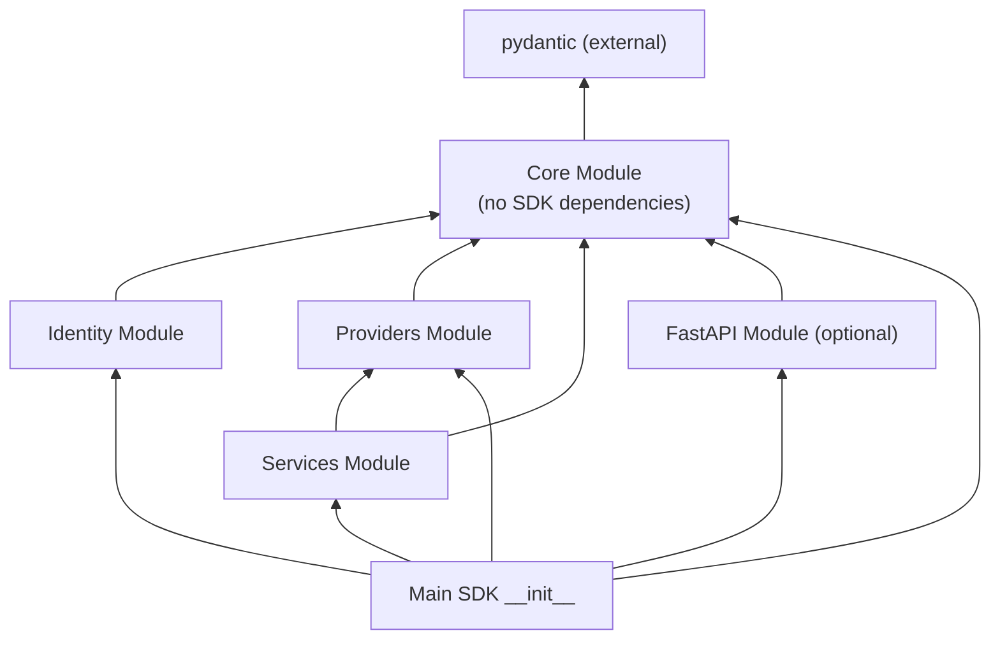

# ITL ControlPlane SDK - Core Concepts

This document covers the fundamental design concepts underlying the ITL ControlPlane SDK: resource handlers, identification strategies, and modular architecture.

---

## Part 1: Scoped Resource Handlers

### Overview

The SDK provides a **configurable, reusable base class for scope-aware resource uniqueness** that enables automatic duplicate detection and prevention for any resource type with customizable scope levels.

### Core Concept: ScopedResourceHandler

The `ScopedResourceHandler` is a generic base class providing:

- **Configurable scopes** - Define uniqueness scope (global, subscription, resource group, management group, parent resource)
- **Automatic storage key generation** - Keys generated based on scope configuration
- **Duplicate detection** - Raises `ValueError` for duplicate names within the same scope
- **Scope-aware retrieval** - Get/list/delete operations respect scope boundaries
- **Backward compatibility** - Supports both old and new storage formats

```python
from itl_controlplane_sdk.providers import ScopedResourceHandler, UniquenessScope

class ScopedResourceHandler:
    UNIQUENESS_SCOPE = [UniquenessScope.GLOBAL]  # Override per resource type
    RESOURCE_TYPE = "unknown"  # Override per resource type
    
    # Public API:
    create_resource(name, data, type, scope_context) → (id, data) or ValueError
    get_resource(name, scope_context) → (id, data) or None
    list_resources(scope_context) → [(name, id, data), ...]
    delete_resource(name, scope_context) → bool
    check_duplicate(name, scope_context) → id or None
```

### Available Scope Levels

```python
class UniquenessScope(Enum):
    GLOBAL              # Unique across entire system
    SUBSCRIPTION        # Unique within a subscription
    RESOURCE_GROUP      # Unique within a resource group
    MANAGEMENT_GROUP    # Unique within a management group
    PARENT_RESOURCE     # Unique within a parent resource
```

### Scope Configuration Examples

| Resource Type | Scope Configuration | Storage Key Example | Use Case |
|---|---|---|---|
| **Resource Groups** | `[SUBSCRIPTION]` | `sub:sub-123/rg-name` | Names unique within subscription |
| **Virtual Machines** | `[SUBSCRIPTION, RESOURCE_GROUP]` | `sub:sub-123/rg:prod-rg/vm-name` | Names unique within RG |
| **Storage Accounts** | `[GLOBAL]` | `uniqueaccount123` | Globally unique (DNS name) |
| **Policies** | `[MANAGEMENT_GROUP]` | `mg:prod-mg/policy-name` | Names unique within MG |
| **Parent Resources** | `[PARENT_RESOURCE]` | `parent:parent-123/child-name` | Names unique within parent |

### Storage Key Format

Automatically generated based on configured scopes:

```
GLOBAL:                    "resource-name"
SUBSCRIPTION:              "sub:subscription_id/resource-name"
SUBSCRIPTION+RG:           "sub:sub_id/rg:rg_name/resource-name"
MANAGEMENT_GROUP:          "mg:mg_id/resource-name"
PARENT_RESOURCE:           "parent:parent_id/resource-name"
```

### Implementation Example

```python
from itl_controlplane_sdk.providers import ScopedResourceHandler, UniquenessScope
from itl_controlplane_sdk import ProvisioningState, ResourceResponse

# 1. Define your handler
class ResourceGroupHandler(ScopedResourceHandler):
    UNIQUENESS_SCOPE = [UniquenessScope.SUBSCRIPTION]
    RESOURCE_TYPE = "resourcegroups"
    
    def __init__(self, storage_dict):
        super().__init__(storage_dict)
    
    # Optional: Add domain-specific methods
    def create_from_properties(self, name, properties, sub_id, location):
        return self.create_resource(
            name,
            {"location": location, "properties": properties},
            "ITL.Core/resourcegroups",
            {"subscription_id": sub_id}
        )

# 2. Initialize in your provider
class CoreProvider(ResourceProvider):
    def __init__(self):
        super().__init__("ITL.Core")
        self.resource_groups = {}
        self.rg_handler = ResourceGroupHandler(self.resource_groups)
    
    async def create_or_update_resource(self, request: ResourceRequest) -> ResourceResponse:
        if request.resource_type == "resourcegroups":
            try:
                rg_id, rg_data = self.rg_handler.create_from_properties(
                    request.resource_name,
                    request.properties,
                    request.subscription_id,
                    request.location
                )
                return ResourceResponse(
                    id=rg_id,
                    name=request.resource_name,
                    provisioning_state=ProvisioningState.SUCCEEDED,
                    properties=rg_data
                )
            except ValueError as e:
                # Duplicate detected
                return ResourceResponse(
                    provisioning_state=ProvisioningState.FAILED,
                    properties={"error": str(e)}
                )

# 3. Use it
handler = ResourceGroupHandler(storage)
try:
    rg_id, rg_data = handler.create_resource(
        "my-rg",
        {"location": "eastus"},
        "ITL.Core/resourcegroups",
        {"subscription_id": "prod-sub"}
    )
except ValueError as e:
    # "Resource 'my-rg' already exists in [subscription]: /subscriptions/..."
    print(f"Duplicate: {e}")
```

### Resource ID Format

Resource IDs are automatically generated with correct Azure-like hierarchy based on scope:

```
SUBSCRIPTION:    /subscriptions/{sub}/resourceGroups/{name}
SUBSCRIPTION+RG: /subscriptions/{sub}/resourceGroups/{rg}/providers/Namespace/type/{name}
GLOBAL:          /providers/Namespace/type/{name}
MANAGEMENT_GROUP: /providers/Microsoft.Management/managementGroups/{mg}/providers/Namespace/type/{name}
```

### Key Capabilities

#### 1. Automatic Duplicate Detection
```python
try:
    handler.create_resource("name", data, type, scope)
except ValueError as e:
    # "Resource 'name' already exists in subscription: /subscriptions/..."
```

#### 2. Flexible Scope Configuration
```python
# Same resource name allowed across different scopes
UNIQUENESS_SCOPE = [
    UniquenessScope.SUBSCRIPTION,
    UniquenessScope.RESOURCE_GROUP
]
# Now unique only within the combination of sub + RG
```

#### 3. Transparent Storage Key Management
```python
# Handler generates: "sub:sub-123/rg:prod-rg/resource-name"
# User only provides: name and scope_context
scope_context = {"subscription_id": "sub-123", "resource_group": "prod-rg"}
resource_id, data = handler.create_resource("name", data, type, scope_context)
```

#### 4. Scope-Aware Operations
```python
# List returns only resources in specified subscription
resources = handler.list_resources({"subscription_id": "sub-1"})

# Get only finds resources in specified scope
result = handler.get_resource("name", {"subscription_id": "sub-1"})
```

### Handler API Reference

```python
# Creation with automatic duplicate detection
create_resource(name, data, type, scope_context) 
  → (resource_id, data) or ValueError

# Retrieval
get_resource(name, scope_context) 
  → (resource_id, data) or None

# Listing in scope
list_resources(scope_context) 
  → [(name, resource_id, data), ...]

# Deletion
delete_resource(name, scope_context) 
  → bool

# Check without creating
check_duplicate(name, scope_context) 
  → resource_id or None
```

### Test Coverage

| Scenario | Result | Notes |
|----------|--------|-------|
| Create RG in subscription |  Works | Basic creation works |
| Get RG by name |  Works | Retrieval within scope |
| Create duplicate in same subscription |  Blocked (409) | Automatic duplicate detection |
| Create same name in different subscription |  Allowed | Cross-scope isolation works |
| List RGs in subscription |  Filtered correctly | Scope-aware listing |
| Delete RG |  Works | Scope-aware deletion |
| Backward compatibility with old storage |  Works | Non-scoped format supported |

---

## Part 2: Resource ID Strategy

### Overview

The ITL ControlPlane SDK supports a **hybrid resource identification strategy** providing both human-readable path-based IDs (Azure ARM-style) and globally unique GUIDs for guaranteed uniqueness.

### ID Strategies Available

#### Strategy 1: Path-Based IDs (Default)

```python
# Human-readable, hierarchical structure following Azure ARM conventions
"/subscriptions/sub-123/resourceGroups/rg-test/providers/Microsoft.Compute/virtualMachines/vm-1"
```

**Use when:**
- Human readability is important
- Following Azure ARM conventions
- Debugging and logging
- Backward compatibility needed

**Pros:**
- Human-readable
- Hierarchical structure
- Familiar to Azure users
- Easy to debug

**Cons:**
- Can be lengthy
- Depends on naming uniqueness
- Path construction complexity

#### Strategy 2: GUID-Based IDs

```python
# Globally unique, guaranteed unique across all systems
"550e8400-e29b-41d4-a716-446655440000"
```

**Use when:**
- Internal system operations
- External integrations
- Database operations
- Distributed systems

**Pros:**
- Guaranteed global uniqueness
- Compact representation
- Efficient indexing
- Time-based sortability (UUIDv1)

**Cons:**
- Not human-readable
- Less intuitive for users
- Additional storage (36 chars)

#### Strategy 3: Dual Identity (Recommended)

```python
# Both path and separate GUID maintained
ResourceResponse(
    id="/subscriptions/.../vm-1",              # Path-based (human-readable)
    resource_guid="550e8400-e29b-41d4-a716-446655440000",  # GUID (unique)
    # ... other fields
)
```

**Use when:**
- Best of both worlds needed
- Building new systems
- Maximum flexibility required
- User-facing and system-facing needs

**Pros:**
- Human-readable path for UI/logs
- Guaranteed uniqueness for systems
- Maximum flexibility
- Seamless migration path

**Cons:**
- Requires storing both
- Slightly more complex

### Implementation Examples

#### For Resource Providers

```python
from itl_controlplane_sdk import generate_resource_id, ResourceResponse, ProvisioningState

class MyResourceProvider(ResourceProvider):
    def __init__(self):
        super().__init__("MyNamespace")
        self._resources = {}
        self._resources_by_guid = {}
    
    async def create_or_update_resource(self, request: ResourceRequest) -> ResourceResponse:
        # Generate hierarchical ID (path-based)
        resource_id = generate_resource_id(
            subscription_id=request.subscription_id,
            resource_group=request.resource_group,
            provider_namespace=self.provider_namespace,
            resource_type=request.resource_type,
            resource_name=request.resource_name
        )
        
        # Create response - GUID is auto-generated
        response = ResourceResponse(
            id=resource_id,
            name=request.resource_name,
            type=f"{self.provider_namespace}/{request.resource_type}",
            location=request.location,
            properties=request.properties,
            provisioning_state=ProvisioningState.SUCCEEDED
            # resource_guid is automatically generated!
        )
        
        # Store by both ID and GUID for flexible lookup
        self._resources[resource_id] = response
        self._resources_by_guid[response.resource_guid] = response
        
        return response
```

#### For Resource Consumers

```python
from itl_controlplane_sdk import parse_resource_id, ResourceIdentity

# Parse any resource ID format
resource_info = parse_resource_id(
    "/subscriptions/sub-123/resourceGroups/rg-test/providers/Microsoft.Compute/virtualMachines/vm-1"
)

print(f"Subscription: {resource_info['subscription_id']}")
print(f"Resource Group: {resource_info['resource_group']}")
print(f"Provider: {resource_info['provider_namespace']}")
print(f"Type: {resource_info['resource_type']}")
print(f"Name: {resource_info['resource_name']}")

# Create comprehensive identity
identity = ResourceIdentity.create(
    subscription_id="sub-123",
    resource_group="rg-test",
    provider_namespace="Microsoft.Compute",
    resource_type="virtualMachines",
    resource_name="vm-1"
)

print(f"Human-readable ID: {identity.resource_id}")
print(f"Unique GUID: {identity.resource_guid}")
```

### Migration Guidelines

#### Immediate Actions (No Breaking Changes)

1. **Continue using existing code** - everything still works
2. **Start using `resource_guid`** in new integrations:

```python
# Old way (still works)
resource_lookup[response.id] = response

# Enhanced way (recommended for new code)
resource_lookup[response.id] = response
guid_lookup[response.resource_guid] = response
```

#### Recommended Enhancements

1. **Update resource storage** to index by both ID and GUID
2. **Use GUIDs for external integrations** (databases, message queues, etc.)
3. **Keep path-based IDs for logging and user interfaces**
4. **Add GUID-based lookup methods** to your providers

### Best Practices

#### Do:
- Use path-based IDs for logging and user-facing operations
- Use GUIDs for internal system operations and external integrations
- Store and index both ID types for maximum flexibility
- Include both in API responses for future-proofing
- Update database schemas with `resource_guid` columns

#### Don't:
- Rely solely on path-based IDs for uniqueness in distributed systems
- Expose GUIDs to end users unless necessary
- Break existing path-based ID assumptions without migration plan
- Store only one ID type if you can avoid it
- Lose track of GUID generation (it's automatic)

### Performance Characteristics

| Operation | Time Complexity | Space Complexity |
|-----------|---|---|
| GUID generation | O(1) | O(1) |
| Path-based lookup | O(1) | O(1) |
| GUID-based lookup | O(1) | O(1) |
| Resource parsing | O(1) | O(1) |

---

## Part 3: Modular Architecture

### Overview

The SDK is organized into distinct modules with clear responsibilities, separation of concerns, and minimal inter-dependencies.

### Package Structure

```
itl_controlplane_sdk/
│
├── core/                          # Core module - Foundation
│   ├── __init__.py               # Exports all core components
│   ├── models.py                 # HTTP models, infrastructure models, constants
│   └── exceptions.py             # Standard exception hierarchy
│
├── identity/                      # Identity module - Provider framework
│   ├── __init__.py               # Factory and provider exports
│   ├── identity_provider_base.py # IdentityProvider ABC
│   ├── identity_provider_factory.py # Factory pattern
│   └── exceptions.py             # Identity-specific exceptions
│
├── providers/                     # Provider framework
│   ├── base.py                   # ResourceProvider ABC
│   ├── registry.py               # ResourceProviderRegistry
│   ├── scoped_resources.py       # ScopedResourceHandler base
│   └── resource_ids.py           # Resource ID utilities
│
├── services/                      # Service patterns
│   └── base.py                   # BaseResourceService
│
├── fastapi/                       # HTTP routing support (optional)
│   ├── app_factory.py
│   ├── config.py
│   ├── middleware/
│   │   ├── error_handling.py
│   │   ├── logging.py
│   │   └── cors.py
│   └── routes/
│       ├── health.py
│       └── metadata.py
│
└── __init__.py                    # Main SDK entry point (70+ unified exports)
```

### Module Exports

#### Core Module Exports

**HTTP Models:**
- ProvisioningState
- ResourceMetadata
- ResourceRequest
- ResourceResponse
- ResourceListResponse
- ErrorResponse

**Infrastructure Models (8):**
- Tag
- ResourceGroup
- ManagementGroup
- Deployment
- Subscription
- Location
- ExtendedLocation
- Policy

**Enums (2):**
- ResourceState (Active, Inactive, Deleted, Pending)
- DeploymentState (Running, Succeeded, Failed, Canceled)

**Exceptions (4):**
- ResourceProviderError (base)
- ResourceNotFoundError
- ResourceConflictError
- ValidationError

**Constants:**
- PROVIDER_NAMESPACE
- 8 RESOURCE_TYPE_* constants
- ITL_RESOURCE_TYPES (list of all types)
- DEFAULT_LOCATIONS (8 default locations)

#### Identity Module Exports

**Interfaces:**
- IdentityProvider (ABC)

**Factory:**
- IdentityProviderFactory
- get_factory() → IdentityProviderFactory
- register_provider(name, class)
- create_provider(name, config) → IdentityProvider
- get_or_create_provider(name, config) → IdentityProvider

**Exceptions:**
- IdentityProviderError (base)
- IdentityProviderNotFoundError
- InvalidCredentialsError
- RealmAlreadyExistsError
- ClientAlreadyExistsError

#### Providers Module Exports

**Interfaces:**
- ResourceProvider (ABC)
- ResourceProviderRegistry

**Utilities:**
- ScopedResourceHandler
- UniquenessScope (Enum)
- ResourceIdentity
- generate_resource_id()
- parse_resource_id()

#### Main SDK Exports (70+)

```python
from itl_controlplane_sdk import (
    # Core models and exceptions (51 items)
    ResourceRequest, ResourceResponse, ResourceGroup, Subscription, 
    ProvisioningState, ResourceProviderError, ...
    
    # Providers (10 items)
    ResourceProvider, ResourceProviderRegistry, ResourceIdentity,
    ScopedResourceHandler, UniquenessScope,
    generate_resource_id, parse_resource_id,
    
    # Services (1 item)
    BaseResourceService,
    
    # Identity (12 items)
    IdentityProvider, IdentityProviderFactory, Tenant, Organization, ...
)
```

### Dependency Graph



### Module Dependencies

```
itl_controlplane_sdk/
├── core/                    (NO dependencies except pydantic)
│   ├── models.py            (pure data structures)
│   └── exceptions.py        (base exceptions)
│
├── identity/                (depends on: core)
│   ├── tenant.py
│   ├── organization.py
│   ├── identity_provider_base.py
│   ├── identity_provider_factory.py
│   └── exceptions.py
│
├── providers/               (depends on: core)
│   ├── base.py              (ResourceProvider ABC)
│   ├── registry.py          (uses ResourceProvider)
│   ├── scoped_resources.py  (ScopedResourceHandler base)
│   └── resource_ids.py      (ID utilities)
│
├── services/                (depends on: core, providers)
│   └── base.py              (BaseResourceService)
│
├── fastapi/                 (depends on: core only)
│   ├── app_factory.py       (creates Apps)
│   ├── config.py
│   ├── middleware/
│   └── routes/
│
└── __init__.py              (imports and exports from all modules)
```

### Usage Examples

#### Import from Core

```python
from itl_controlplane_sdk.core import (
    ResourceRequest,
    ResourceResponse,
    ResourceGroup,
    ResourceProviderError,
    ProvisioningState,
)
```

#### Import from Main SDK (Recommended)

```python
from itl_controlplane_sdk import (
    ResourceRequest,
    ResourceResponse,
    ResourceGroup,
    ResourceProviderError,
    ProvisioningState,
)
```

#### Identity Provider Framework

```python
from itl_controlplane_sdk.identity import (
    get_factory as get_identity_factory,
    register_provider,
)
from keycloak_identity_provider import KeycloakIdentityProvider

# Register and use
register_provider("keycloak", KeycloakIdentityProvider)
factory = get_identity_factory()
provider = factory.create("keycloak", config)
realms = await provider.get_realms()
```

#### Resource Provider Framework

```python
from itl_controlplane_sdk import (
    ResourceProvider, ResourceProviderRegistry, ResourceRequest, ResourceResponse
)

class MyProvider(ResourceProvider):
    async def create_or_update_resource(self, request: ResourceRequest) -> ResourceResponse:
        # Implementation
        pass

registry = ResourceProviderRegistry()
registry.register_provider("my-provider", "resource_type", MyProvider("namespace"))
```

### Benefits of Modular Architecture

**✓ Separation of Concerns**
- Core: Pure data models and exceptions
- Identity: Pluggable identity providers
- Providers: Resource provider framework
- Services: Reusable application patterns
- FastAPI: Optional HTTP layer

**✓ Clear Dependencies**
- Core has no external dependencies (except pydantic)
- Identity imports from core only
- Providers import from core only
- Services import from core + providers
- FastAPI imports from core only
- Main SDK imports from all modules

**✓ Easier Testing**
- Test core without any dependencies
- Test identity with mock providers
- Test providers with mock registries
- Test services with mock providers
- Test all together via main SDK

**✓ Maintainability**
- Each module has single responsibility
- Changes localized to relevant module
- Easier to understand and extend
- Clear import patterns for all providers

**✓ Scalability**
- Easy to add new identity providers
- Can add new modules (e.g., storage, compute) without affecting existing
- Clear import patterns and conventions
- Minimal coupling between modules

---

## Integration Example: Complete Provider With All Concepts

This example shows how the three core concepts work together:

```python
from itl_controlplane_sdk import (
    ResourceProvider, ResourceProviderRegistry, ResourceIdentity,
    ScopedResourceHandler, UniquenessScope,
    ResourceRequest, ResourceResponse, ProvisioningState
)

# 1. Define scope-aware handler using Part 1 concepts
class VirtualMachineHandler(ScopedResourceHandler):
    UNIQUENESS_SCOPE = [UniquenessScope.SUBSCRIPTION, UniquenessScope.RESOURCE_GROUP]
    RESOURCE_TYPE = "virtualmachines"

# 2. Create provider using Part 2 & 3 concepts
class ComputeProvider(ResourceProvider):
    def __init__(self):
        super().__init__("ITL.Compute")
        self.virtual_machines = {}
        self.vm_handler = VirtualMachineHandler(self.virtual_machines)
    
    async def create_or_update_resource(self, request: ResourceRequest) -> ResourceResponse:
        try:
            # Use handler for scope-aware creation
            vm_id, vm_data = self.vm_handler.create_resource(
                request.resource_name,
                request.properties,
                f"{self.provider_namespace}/virtualmachines",
                {
                    "subscription_id": request.subscription_id,
                    "resource_group": request.resource_group
                }
            )
            
            # Return response with both path-based ID and GUID
            return ResourceResponse(
                id=vm_id,                          # Path-based ID (Part 2)
                name=request.resource_name,
                type=f"{self.provider_namespace}/virtualmachines",
                provisioning_state=ProvisioningState.SUCCEEDED,
                properties=vm_data,
                # resource_guid auto-generated (Part 2)
            )
        except ValueError as e:
            return ResourceResponse(
                provisioning_state=ProvisioningState.FAILED,
                properties={"error": str(e)}
            )
    
    async def get_resource(self, request: ResourceRequest) -> ResourceResponse:
        result = self.vm_handler.get_resource(
            request.resource_name,
            {
                "subscription_id": request.subscription_id,
                "resource_group": request.resource_group
            }
        )
        
        if not result:
            raise ResourceNotFoundError(f"VM {request.resource_name} not found")
        
        vm_id, vm_data = result
        return ResourceResponse(
            id=vm_id,
            name=request.resource_name,
            properties=vm_data
        )

# 3. Use modular architecture to register provider (Part 3)
from itl_controlplane_sdk import ResourceProviderRegistry

registry = ResourceProviderRegistry()
registry.register_provider("ITL.Compute", "virtualmachines", ComputeProvider())

# Now you have:
# - Scope-aware uniqueness (Part 1: VirtualMachineHandler)
# - Human-readable + GUID IDs (Part 2: Dual identity)
# - Clean modular design (Part 3: Separation of concerns)
```

---

## Related Documentation

- [02-ARCHITECTURE.md](02-ARCHITECTURE.md) - Complete system architecture overview
- [06-HANDLER_MIXINS.md](06-HANDLER_MIXINS.md) - Advanced handler patterns (TimestampedResourceHandler, etc.)
- [04-RESOURCE_GROUPS.md](04-RESOURCE_GROUPS.md) - Resource group implementation details
- [08-API_ENDPOINTS.md](08-API_ENDPOINTS.md) - FastAPI integration patterns

---

This modular architecture provides a solid foundation for building scalable resource management systems while maintaining code clarity and extensibility.
