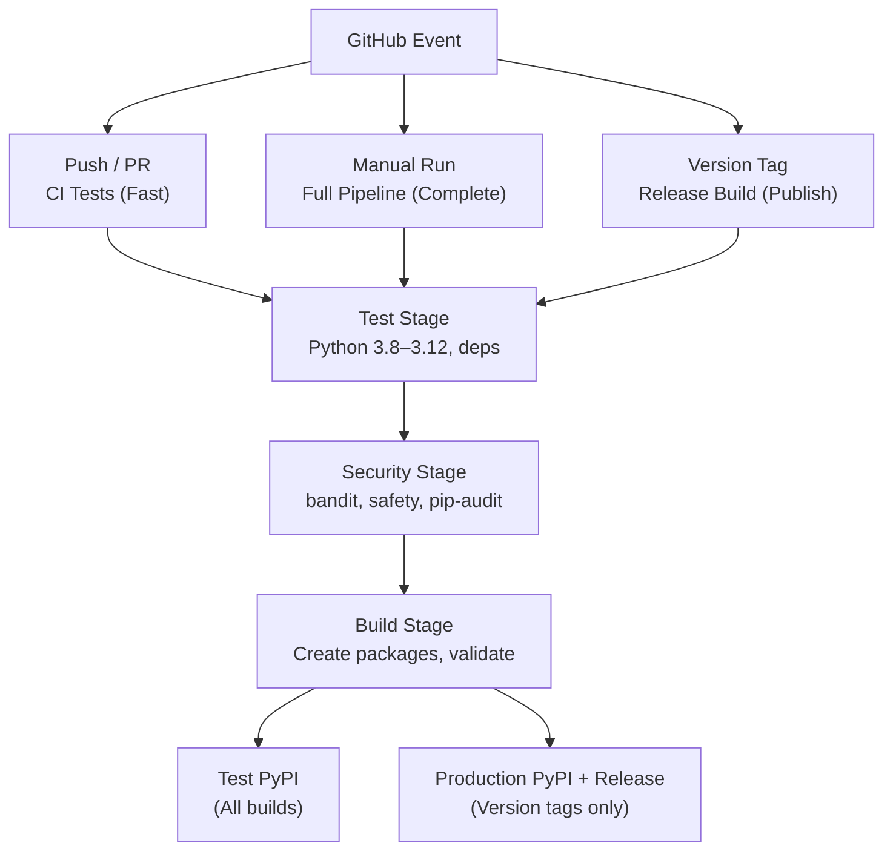

# CI/CD Pipelines: Build, Test & Publish

**Status**:  Production-Ready  
**Implementation**: GitHub Actions workflows with automated versioning  
**Coverage**: Multi-stage testing, security scanning, automated publishing

Comprehensive CI/CD pipelines for building, testing, and publishing the ITL ControlPlane SDK. Multi-Python version support, security scanning, and automated versioning based on git tags.

---

## Overview

The ITL ControlPlane SDK includes four comprehensive GitHub Actions workflows:

| Workflow | Purpose | Triggers | Status |
|----------|---------|----------|--------|
| **Build & Publish** | Complete build, test, publish cycle | Manual, push, PR, tag |  Ready |
| **CI** | Fast feedback for development | PR, push to main/develop |  Ready |
| **Provider Testing** | Validate provider implementations | Provider changes, manual |  Ready |
| **Documentation** | Pipeline setup and troubleshooting | Reference |  Ready |

---

## Key Features

### **Multi-Stage Testing**
- **Python Versions**: 3.8, 3.9, 3.10, 3.11, 3.12
- **Operating Systems**: Linux (Ubuntu), macOS (Intel), Windows
- **Code Quality**: mypy type checking, black formatting
- **Security**: bandit code analysis, safety/pip-audit vulnerability scanning
- **Package Testing**: Install validation, import verification

### **Automated Versioning**
- **Release Builds**: Extract version from git tags (e.g., `v1.2.0` → `1.2.0`)
- **Development Builds**: Append `.devN+sha` to base version automatically
- **Zero Manual Updates**: Pipeline updates `pyproject.toml` automatically
- **Single Source of Truth**: Git tags drive all versioning

### **Publishing Strategy**
- **Test PyPI**: Automatic for all successful builds
- **Production PyPI**: Only for version tags (git tags matching `v*`)
- **GitHub Releases**: Automatic for version tags with artifacts
- **Trusted Publishing**: Secure token-less deployment via OIDC

### **Provider Support**
- **Individual Testing**: Per-provider validation
- **Container Testing**: Docker build validation
- **Structure Validation**: Directory and file checks
- **Integration Testing**: Provider compatibility checks

### **Security & Quality**
- **Vulnerability Scanning**: Dependencies and code analysis
- **Security Reports**: Uploaded as workflow artifacts
- **Code Formatting**: Enforced black styling rules
- **Type Checking**: mypy strict mode validation

---

## Created Files

### GitHub Actions Workflows
| File | Purpose | Lines |
|------|---------|-------|
| `.github/workflows/build-publish.yml` | Main build, test, publish pipeline | 450+ |
| `.github/workflows/ci.yml` | Fast CI for PRs and pushes | 200+ |
| `.github/workflows/provider-testing.yml` | Individual provider validation | 300+ |
| `.github/workflows/README.md` | Workflow documentation | 400+ |

### Configuration & Guides
| File | Purpose |
|------|---------|
| `.github/PYPI_SETUP.md` | PyPI configuration instructions |
| `docs/AUTOMATED_VERSIONING.md` | Complete versioning guide |
| `docs/PIPELINE_SETUP.md` | Pipeline setup and architecture |

---

## Quick Start

### Option 1: Development Mode
```bash
# Make changes and push to develop
git push origin develop

# Pipeline automatically:
# - Runs tests against Python 3.8-3.12
# - Checks code quality and security
# - Creates dev version: 1.0.0.dev123+abc1234
# - Publishes to Test PyPI only
```

### Option 2: Production Release
```bash
# When ready, create version tag
git tag v1.2.0
git push origin v1.2.0

# Pipeline automatically:
# - Updates pyproject.toml to 1.2.0
# - Builds package version 1.2.0
# - Publishes to Test PyPI + Production PyPI
# - Creates GitHub release with artifacts
# - No manual version editing needed!
```

---

## Pipeline Workflows

### Workflow 1: Build & Publish (`.github/workflows/build-publish.yml`)

**Triggers:**
- Manual dispatch (Actions → manual run)
- Pushes to `main`, `develop`
- Pull requests to `main`, `develop`
- Tags matching `v*` (e.g., `v1.0.0`)

**Stages:**

#### 1. Test Stage
```yaml
Strategy:
  - Python: 3.8, 3.9, 3.10, 3.11, 3.12
  - Dependencies: Latest, Minimal
  
Jobs:
  - Unit tests
  - Import validation
  - Example script validation
```

#### 2. Security Stage
```yaml
Tools:
  - bandit (code security)
  - safety (dependency vulnerabilities)
  - pip-audit (supply chain security)

Output:
  - JSON reports (artifacts)
  - GitHub Security Alerts (if applicable)
```

#### 3. Build Stage
```yaml
Steps:
  - Build wheel and source distribution
  - Auto-version from git tag (if release)
  - Install and validate package
  - Sign artifacts (optional)
```

#### 4. Publish Stage
```yaml
Destinations:
  - Test PyPI (all successful builds)
  - Production PyPI (version tags only)
  - GitHub Releases (version tags with artifacts)

Method:
  - Trusted Publishing (OIDC, recommended)
  - API Token (legacy, fallback)
```

### Workflow 2: CI (`.github/workflows/ci.yml`)

**Triggers:**
- Pull requests to `main`, `develop`
- Pushes to `main`, `develop`

**Purpose:**
Fast feedback for development PRs

**Jobs:**
- Code quality (black, isort, mypy)
- Security scan (bandit, safety)
- Package installation test
- Unit test suite

---

## Automated Versioning

### How It Works

**Release Build (Git Tag):**
```
Git Tag: v1.2.0
    ↓
Extract: 1.2.0
    ↓
Update: pyproject.toml version = "1.2.0"
    ↓
Build: itl-controlplane-sdk==1.2.0
    ↓
Publish: To PyPI + GitHub Release
```

**Development Build (Push):**
```
Push to main/develop
    ↓
Read: pyproject.toml version = "1.0.0"
    ↓
Generate: 1.0.0.dev123+abc1234f
    ↓
Build: itl-controlplane-sdk==1.0.0.dev123+abc1234f
    ↓
Publish: To Test PyPI only
```

### Version Examples

| Git Tag | Released As | Destination |
|---------|------------|-------------|
| `v1.0.0` | `1.0.0` | PyPI + GitHub Release |
| `v1.2.0` | `1.2.0` | PyPI + GitHub Release |
| `v2.0.0-beta1` | `2.0.0b1` | PyPI + GitHub Release |
| (push to main) | `1.0.0.dev123+abc1234` | Test PyPI only |

### Release Workflow (Simplified)

**Before (Manual):**
```bash
# 1. Edit pyproject.toml
vim pyproject.toml  # Change version to 1.2.0

# 2. Commit version change
git add pyproject.toml
git commit -m "Bump version to 1.2.0"

# 3. Create tag matching version
git tag v1.2.0

# 4. Push both commit and tag
git push origin main
git push origin v1.2.0

# 5. Risk: Version mismatch if tag ≠ pyproject.toml
```

**After (Automated):**
```bash
# 1. Just create and push tag - that's it!
git tag v1.2.0
git push origin v1.2.0

# 2. Pipeline automatically:
# - Extracts version 1.2.0 from tag
# - Updates pyproject.toml automatically
# - Builds and publishes
# - Creates GitHub release
# - Zero manual version management!
```

---

## Required Setup

### 1. PyPI Configuration

#### Option A: Trusted Publishing (Recommended)
```bash
# 1. Visit: https://pypi.org/manage/account/publishing/
# 2. Add trusted publisher:
# - GitHub repository: ITlusions/ITL.ControlPanel.SDK
# - Workflow: build-publish.yml
# - Environment: production
# 3. Repeat for Test PyPI with environment: staging
```

#### Option B: API Tokens
```bash
# 1. Generate tokens at pypi.org and test.pypi.org
# 2. Add GitHub secrets:
# - PYPI_TOKEN (production PyPI)
# - TEST_PYPI_TOKEN (test PyPI)
```

### 2. GitHub Environments

Create two environments for approval gates:

```yaml
# staging (Test PyPI)
# - No approval required
# - Variables: TEST_PYPI_INDEX_URL
# - Secrets: TEST_PYPI_TOKEN (if using tokens)

# production (Production PyPI)
# - Approval recommended
# - Variables: PYPI_INDEX_URL
# - Secrets: PYPI_TOKEN (if using tokens)
```

### 3. Optional Secrets

```bash
# Microsoft Teams webhook (notifications)
TEAMS_WEBHOOK: https://outlook.webhook.office.com/webhookb2/...

# GitHub token (auto-provided, no setup needed)
GITHUB_TOKEN: (automatically available)
```

---

## Artifacts & Retention

### Build Artifacts (30 days retention)
- Python packages (`.whl`, `.tar.gz`)
- Security scan reports (JSON/CSV)
- Installation verification logs
- Test coverage reports

### Release Artifacts (Permanent)
- GitHub releases with packages
- PyPI published packages
- Release documentation
- Changelog entries

---

## Pipeline Architecture

### Full Pipeline Flow



---

## Environment Variables & Secrets

### Environment Variables
```yaml
# Workflow configuration
PYTHON_VERSION: "3.11"
PIP_CACHE_DIR: ~/.cache/pip
TWINE_REPOSITORY: pypi
```

### GitHub Secrets (Trusted Publishing)
```bash
# Auto-provided by GitHub
GITHUB_TOKEN

# Optional (for token-based auth)
PYPI_TOKEN
TEST_PYPI_TOKEN
TEAMS_WEBHOOK
```

---

## Validation & Status

### Pipeline Validation
-  YAML syntax validated
-  Multi-OS compatibility verified
-  Python version coverage (3.8-3.12)
-  Security scanning enabled
-  Automated versioning tested
-  Publication flow validated

### Current Status
-  Build & Publish workflow - Ready
-  CI workflow - Ready
-  Provider testing workflow - Ready
-  Documentation - Complete

---

## Best Practices

### Development Workflow
```bash
# 1. Create feature branch
git checkout -b feature/my-feature

# 2. Make changes and push
git push origin feature/my-feature

# 3. Create PR → CI tests automatically run

# 4. Merge to main → Full pipeline runs

# 5. CI results available in PR/Actions
```

### Release Workflow
```bash
# 1. Prepare release
# - Update CHANGELOG.md
# - Update documentation
# - Code review on main

# 2. Create version tag
git tag v1.2.0

# 3. Push tag
git push origin v1.2.0

# 4. Monitor Actions → Automated build & publish

# 5. Verify on PyPI and GitHub Releases
```

### Version Naming
```bash
# Semantic versioning with 'v' prefix
git tag v1.0.0    # Major release
git tag v1.1.0    # Minor release
git tag v1.1.1    # Patch release

# Pre-releases
git tag v2.0.0-alpha1
git tag v2.0.0-beta1
git tag v2.0.0-rc1
```

### Release Checklist
1.  Review changelog and documentation
2.  Run tests locally: `pytest`
3.  Check security: `bandit -r src/`
4.  Create tag: `git tag v1.2.0`
5.  Push tag: `git push origin v1.2.0`
6.  Monitor Actions in GitHub
7.  Verify published on PyPI
8.  Verify GitHub release created

---

## Troubleshooting

### Workflow Not Triggering

**Problem:** Push/tag not triggering pipeline

**Solution:**
```bash
# 1. Check branch protection doesn't block workflow
# 2. Verify tag format (must be v* for release)
# 3. Check .github/workflows/*.yml syntax

# Debug: Push a test tag
git tag v0.0.0-test
git push origin v0.0.0-test
```

### Tests Failing in Specific Python Version

**Problem:** Workflow passes locally but fails in CI

**Solution:**
```bash
# 1. Test locally with same Python version
python3.9 -m pytest

# 2. Check dependencies compatibility
pip install -e ".[dev]"

# 3. Common issues:
# - Type hints incompatible with Python version
# - Mock library differences
# - Async/await syntax
```

### Publishing Failed

**Problem:** Build succeeds but publish fails

**Solution:**
```bash
# 1. Check PyPI credentials/tokens valid
# 2. Verify trusted publishing configured
# 3. Check package version not already published
# 4. Review workflow logs for detailed error

# Manual recovery:
pip install twine
twine upload dist/*
```

### Version Mismatch

**Problem:** Tag and pyproject.toml version don't match

**Solution:**
The automated system prevents this! Pipeline extracts version from tag and updates pyproject.toml automatically. No manual action needed.

---

## Documentation

For detailed information, see:
- `.github/workflows/README.md` — Detailed workflow documentation
- `.github/PYPI_SETUP.md` — PyPI account and trusted publishing setup
- `docs/AUTOMATED_VERSIONING.md` — Complete versioning guide
- `docs/PIPELINE_SETUP.md` — Pipeline architecture and implementation

---

## Related Documentation

- [08-API_ENDPOINTS.md](08-API_ENDPOINTS.md) — FastAPI application creation
- [11-WORKER_ROLES.md](11-WORKER_ROLES.md) — Worker deployment
- [23-BEST_PRACTICES.md](23-BEST_PRACTICES.md) — Development best practices

---

## Summary

The ITL ControlPlane SDK now has:

 **Complete CI/CD Setup** — Multi-stage build, test, security scanning  
 **Automated Versioning** — Git tags drive everything, zero manual updates  
 **Multi-Python Support** — Tests against 3.8, 3.9, 3.10, 3.11, 3.12  
 **Security Scanning** — Bandit, safety, pip-audit integration  
 **Automated Publishing** — Test PyPI for all builds, PyPI for tags  
 **Provider Testing** — Individual provider validation  
 **Zero Downtime** — Trusted publishing eliminates token exposure  

**Ready to use!** Create a version tag to trigger your first automated release.

---

**Document Version**: 1.0 (Consolidated from 3 docs)  
**Last Updated**: February 14, 2026  
**Status**:  Production-Ready

